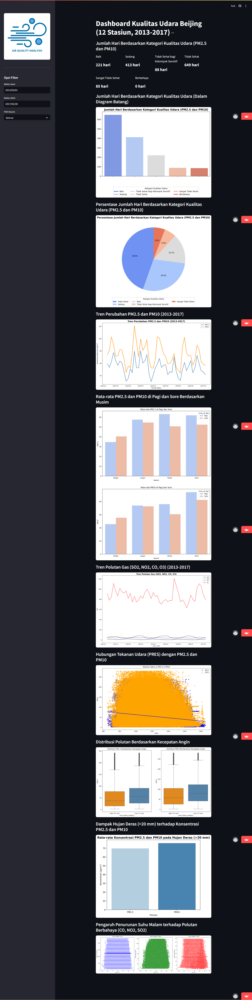

# Air-Quality-Analysis
This repository contains code archives for Final Project Dicoding Course Belajar Analisis Data dengan Python.

## Deployment
Link deployment for public:
https://air-quality-analysis-by-ika.streamlit.app/

## Directory Structure
```bash
Air-Quality-Analysis/
│
├── SS/                 
│   └── SS.png
│
├── dashboard/                 
│   ├── air-quality.png
│   ├── dashboard.py
│   └── main_data.csv
│
├── data/
│   ├── PRSA_Data_Aotizhongxin_20130301-20170228.csv
│   ├── PRSA_Data_Changping_20130301-20170228.csv
│   ├── PRSA_Data_Dingling_20130301-20170228.csv
│   ├── PRSA_Data_Dongsi_20130301-20170228.csv
│   ├── PRSA_Data_Guanyuan_20130301-20170228.csv
│   ├── PRSA_Data_Gucheng_20130301-20170228.csv
│   ├── PRSA_Data_Huairou_20130301-20170228.csv
│   ├── PRSA_Data_Nongzhanguan_20130301-20170228.csv
│   ├── PRSA_Data_Shunyi_20130301-20170228.csv
│   ├── PRSA_Data_Tiantan_20130301-20170228.csv
│   ├── PRSA_Data_Wanliu_20130301-20170228.csv
│   └── PRSA_Data_Wanshouxigong_20130301-20170228.csv
│
├── LICENSE.txt
├── README.md
├── notebook.ipynb
├── requirements.txt
└── url.txt
```

## Project Setup / Installation Instructions
1. Clone the repository from GitHub:  
   ```
   git clone https://github.com/ikanurfitriani/Air-Quality-Analysis.git
   ```

2. Navigate to the project directory:  
   ```
   cd Air-Quality-Analysis
   ```

3. Install the required dependencies:  
   ```
   pip install -r requirements.txt
   ```

4. Navigate to the dashboard directory:  
   ```
   cd dashboard
   ```

5. Run the Streamlit application:  
   ```
   streamlit run dashboard.py
   ```

## Screen Capture
The following is a screen capture from the Air Quality Analysis - Version 1.0 dashboard:
- `SS`


## Author
[@Ika Nurfitriani](https://github.com/ikanurfitriani)
